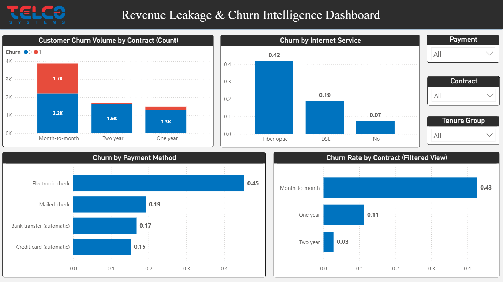
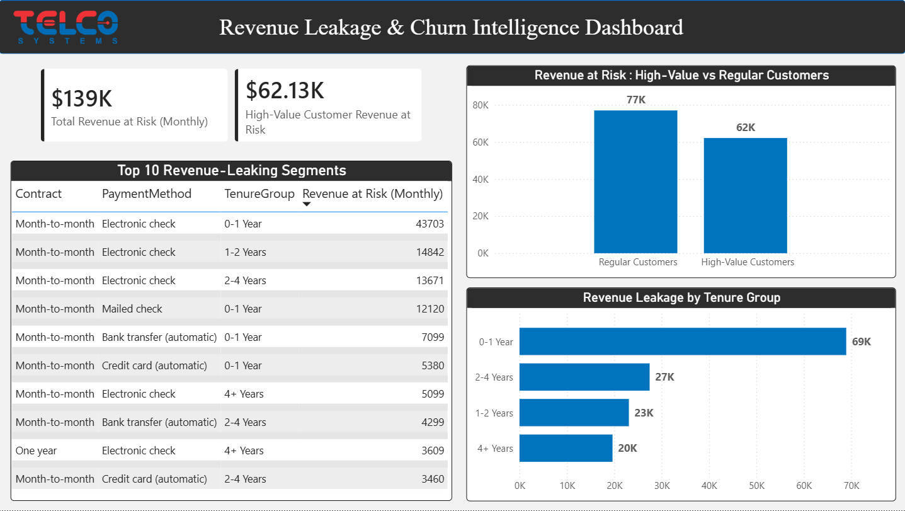
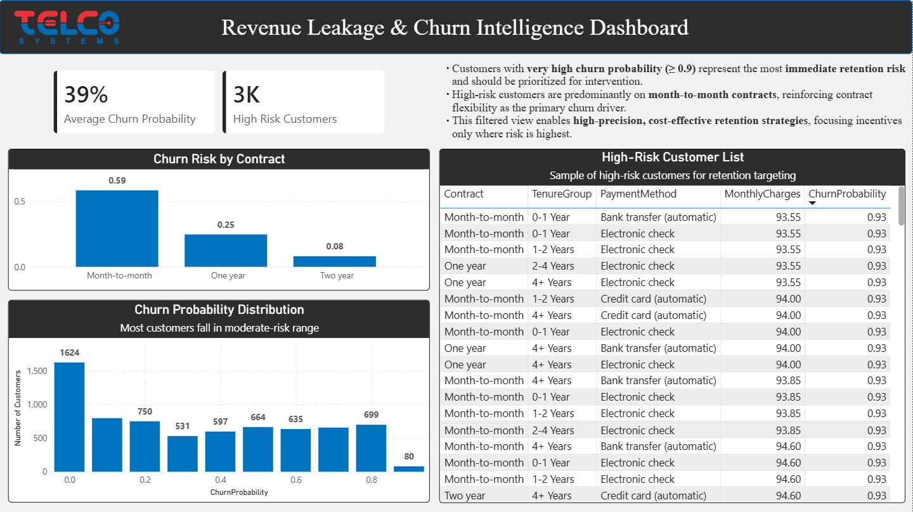

# Revenue Leakage & Churn Intelligence Dashboard

## Overview
The **Revenue Leakage & Churn Intelligence Dashboard** is an executive-level analytics solution designed to help organizations understand **customer churn behavior**, quantify **financial exposure due to churn**, and identify **high-risk customers for targeted retention actions**.

Rather than focusing solely on churn percentages, this dashboard connects **customer behavior to revenue impact**, enabling stakeholders to prioritize retention strategies based on **business value and risk**. The solution emphasizes clarity, interpretability, and decision-readiness, following industry best practices for analytical dashboards.

---

## Business Objectives
The primary objectives of this project are to:

- Measure overall **customer churn levels** and monitor churn trends
- Quantify **monthly and annual revenue at risk** due to customer churn
- Identify **customer segments** that contribute disproportionately to churn and revenue loss
- Understand key **behavioral and service-related churn drivers**
- Enable **risk-based customer targeting** instead of blanket retention campaigns
- Provide leadership with a **single source of truth** for churn and revenue leakage analysis

---

## Dataset Description
The dashboard is built using a cleaned telecom customer dataset that captures customer demographics, service usage, billing information, and churn outcomes.

The dataset includes:
- Customer tenure and tenure group classifications
- Contract type and subscription duration
- Internet services and add-on services
- Payment methods and billing behavior
- Monthly charges and estimated revenue impact
- Binary churn indicator
- Model-generated churn probability score

### Key Fields Used
- `Churn` – Indicates whether the customer has churned
- `ChurnProbability` – Predicted likelihood of customer churn
- `Contract` – Contract duration category
- `TenureGroup` – Grouped customer tenure buckets
- `PaymentMethod` – Customer payment type
- `InternetService` – Internet service subscription
- `MonthlyCharges` – Monthly billing amount
- `RevenueAtRisk` – Estimated revenue exposure due to churn

---

## Tools & Technologies
- **Power BI**
  - Data modeling and relationship management
  - Interactive dashboard development
  - Business-ready visualizations
- **DAX**
  - KPI calculations
  - Revenue at risk measures
  - Risk-based aggregations
- **Data Preprocessing**
  - Cleaned and feature-engineered dataset
  - Derived tenure groups and revenue metrics
- **GitHub**
  - Version control
  - Project documentation and portfolio presentation

---

## Dashboard Pages

---

## Page 1: Executive Overview 

**Fig 1:** Executive overview summarizing customer churn and revenue exposure.

### Purpose
This page provides a **high-level summary** for executives and senior stakeholders, enabling them to quickly assess the scale of churn and its financial impact.

### What This Page Shows
- Total number of customers
- Overall customer churn rate
- Monthly revenue at risk
- Annualized revenue at risk
- Churn rate by contract type
- Revenue at risk by contract and tenure group
- Churn rate trend across tenure groups

### Key Insights
- Month-to-month contracts exhibit the **highest churn rate**, making them a primary retention risk
- Customers in their **early tenure period** contribute the largest share of revenue at risk
- Longer contract durations significantly reduce churn, indicating contract length as a key retention lever

---

## Page 2: Churn Drivers & Customer Behavior

**Fig 2:** Diagnostic analysis of churn behavior across customer attributes.

### Purpose
This page focuses on **diagnostic analysis**, answering the question: *why are customers churning?*

### What This Page Shows
- Churn volume distribution by contract type
- Churn rate by internet service category
- Churn rate by payment method
- Churn rate by contract type (filtered view)
- Interactive slicers for focused analysis

### Key Insights
- Customers using **fiber optic services** show significantly higher churn rates
- **Electronic check** payment method is strongly associated with higher churn
- Month-to-month contracts dominate churn volume even after applying filters

### Business Value
This analysis helps identify **operational and behavioral factors** that can be addressed through service improvements, pricing strategies, or payment incentives.

---

## Page 3: Revenue Leakage Analysis

**Fig 3:** Financial impact analysis highlighting revenue leakage across customer segments.

### Purpose
This page shifts focus from churn volume to **financial impact**, identifying where churn results in the greatest revenue loss.

### What This Page Shows
- Total revenue at risk on a monthly basis
- Revenue at risk attributable to high-value customers
- Revenue leakage by tenure group
- Top revenue-leaking customer segments

### Key Insights
- A small number of customer segments account for a **disproportionate share of total revenue loss**
- High-value customers represent a **significant portion of revenue at risk**
- Customers in early tenure stages are the largest contributors to revenue leakage

### Business Value
Supports **ROI-driven retention decisions** by directing resources toward the segments with the highest financial exposure.

---

## Page 4: High-Risk Customer Identification

**Fig 4:** Action-oriented identification of customers with very high churn risk.

### Purpose
This page is designed for **execution and action**, enabling teams to identify customers who require immediate retention efforts.

### What This Page Shows
- Average churn probability across the customer base
- Count of customers classified as high risk
- Churn probability distribution
- Churn risk comparison by contract type
- Filtered list of customers with churn probability ≥ 0.91

### Key Insights
- Customers with very high churn probability represent **immediate and critical retention risk**
- High-risk customers are predominantly on **month-to-month contracts**
- Risk-based filtering enables **high-precision retention strategies**, minimizing unnecessary incentives for low-risk customers

---

## Key KPIs
- Customer Churn Rate
- Revenue at Risk (Monthly)
- Revenue at Risk (Annual)
- Average Churn Probability
- High-Risk Customer Count
- Revenue at Risk by Customer Segment

---

## Design Principles Followed
- Clear separation between overview, diagnostics, financial impact, and action
- Consistent currency formatting and metric naming
- Descending sort order to highlight priority segments
- High data-to-ink ratio with minimal visual clutter
- Business-oriented titles and contextual annotations

---

## Business Impact
This dashboard enables organizations to:
- Proactively reduce churn through **risk-based targeting**
- Protect high-value revenue streams
- Improve retention ROI by focusing on customers most likely to churn
- Support leadership with **clear, explainable, and actionable insights**

---

## Project Structure
Revenue Leakage Churn Intelligence/
│
├── data/
│   ├── raw/
│   │   └── WA_Fn-UseC_-Telco-Customer-Churn.csv
│   │
│   └── processed/
│       ├── telco_churn_cleaned.csv
│       └── telco_churn_with_predictions.csv
│
├── models/
│   └── churn_model.pkl
│
├── notebooks/
│   ├── 01_data_cleaning.ipynb
│   ├── 02_eda.ipynb
│   ├── 03_churn_model.ipynb
│   └── 04_load_csv_to_mysql.ipynb
│
├── powerbi/
│   └── Revenue_Leakage_&_Churn_Intelligence_Dashboard.pbix
│
├── screenshots/
│   ├── Executive_Overview.png
│   ├── Churn_Intelligence.png
│   ├── Revenue_Leakage_Analysis.png
│   └── ML_Insights.png
│
├── sql/
│   ├── churn_analysis.sql
│   └── revenue_metrics.sql
│
└── README.md

---

## Conclusion
The **Revenue Leakage & Churn Intelligence Dashboard** demonstrates a production-ready approach to churn analytics by combining customer behavior analysis, financial impact assessment, and risk-based prioritization. The solution is designed to move beyond descriptive reporting and directly support **data-driven retention decision-making**.